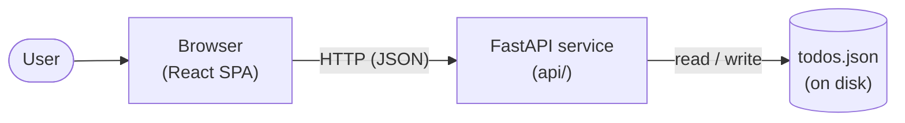

# Architecture

Two processes: a React single-page app served by Vite, and a FastAPI HTTP
service. State lives only in the API process.

## Components

### `web/` — React SPA (Vite, TypeScript)
- Renders the UI
- Calls the API over HTTP for all state changes
- Holds no source of truth — re-fetches on mount and after mutations

### `api/` — FastAPI service (Python, uv)
- Owns all todo state
- Exposes a small HTTP API for the SPA
- Reads and writes `api/todos.json` on every request (see Persistence)

## Data flow

1. Browser loads the SPA from Vite's dev server
2. SPA makes HTTP requests to the API (`VITE_API_PORT`, default 9000)
3. API handlers read/write `api/todos.json` and return JSON
4. SPA updates its local view state from the response

## Persistence

A single JSON file at `api/todos.json` is the database. Each request that
mutates state reads, modifies, and rewrites the whole file. No schema
migrations, no external DB. Good enough for a single-user toy app; it is
not concurrency-safe and is not a pattern to lift into production.

The file is gitignored.

## Diagram

