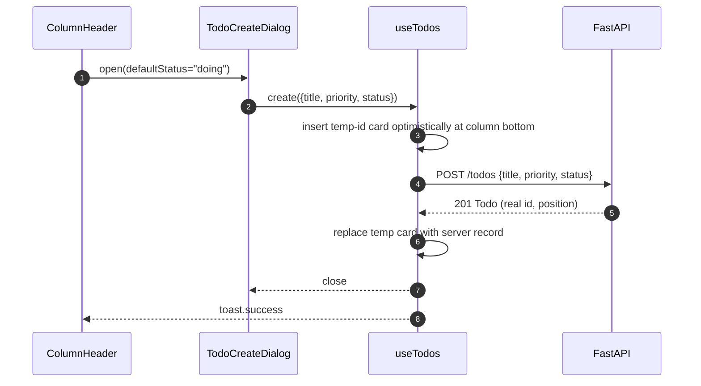

# Plan — Add Kanban view to the todos app

## 1. Summary

Add a `/board` route rendering three fixed columns (Todo / Doing / Done) backed by a replaced server-side `status` enum plus integer `position` ordering. Drag-and-drop uses `@dnd-kit` with keyboard sensor and custom announcements; optimistic UI lives in a hand-rolled reducer inside `useTodos` so a drag never snaps back. The list view keeps its existing shape at `/`. Headline tradeoff: we take on ~18 KB gz (`@dnd-kit` + router) and introduce a client-owned optimistic cache — the only way to meet the "no snap-back on drag" requirement without adopting SWR/TanStack Query.

## 2. Key design decisions

### 2.1 Accessibility target — WCAG 2.1 A (keyboard-reachable), not 2.2 AA

Keyboard operability only. `@dnd-kit`'s `KeyboardSensor` is the non-drag path; we override the default `announcements` prop to use `todo.title` and "position N of M" phrasing (defaults leak raw UUIDs; see `accessibility.md:19`). No per-card status `<Select>` as a primary affordance — the user explicitly descoped AA. *Rejected:* WCAG 2.2 AA with per-card status Select; would have matched Linear/GitHub but doubles affordance surface for a single-user app.

### 2.2 Data model — replace `completed: bool` with `status: "todo"|"doing"|"done"`

Breaking change (Option A in `data-model.md:55`). `TodoResponse` / `TodoCreate` / `TodoUpdate` all switch. Rationale: one source of truth, extensible (`"blocked"` later), and the checkbox affordance goes away cleanly. *Rejected:* Option B (keep `completed` as derived) — two fields to keep in sync, invites drift via `TodoUpdate`'s `exclude_unset`.

### 2.3 Migration — hard reset of `api/todos.json`

The file is reset to `[]` as a step in Phase 1. No Pydantic default for `completed`, no read-time backfill, no compat shim. Anti-pattern to avoid: `Optional`-everything on `TodoResponse` just to survive legacy rows (see `api/anti-patterns/schemas.md:98`). Rationale: single-user toy app, file is gitignored, user approved breakage.

### 2.4 Ordering — integer `position`, step 1000, append-bottom on cross-column move

`position: int` on every todo (`column-ordering.md:61`). New item is `max(position in destination column) + 1000`, `1000` if the column is empty. Reorder inside a column uses the midpoint `(prev + next) // 2`. Rebalance trigger: if `next - prev <= 1` at insert time, renumber the whole destination column to `1000, 2000, …` in one `storage.save`. *Rejected:* LexoRank (overkill, bucket logic for ~dozen cards), float positions (precision decay), linked-list (O(n) reads).

### 2.5 View coexistence — separate routes via `react-router` v7

Routes: `/` (list, current view), `/board` (Kanban). Router choice: **`react-router` v7** (data-router mode, ~11 KB gz, React 19 supported, de-facto standard, ships `<Link>` / `useNavigate` / `<Outlet>`). *Rejected:* TanStack Router (great type-safety but ~30 KB gz + a loader concept we don't need), `wouter` (~2 KB gz but the user wants future extensibility — nav chrome, eventual detail routes — and `react-router`'s layout-route pattern solves that natively). Introduces the codebase's first router and first nav chrome.

### 2.6 UI hosting — inside `web/src/features/todos/`

Follows `docs/blueprints/web/best-practices/folder-structure.md:22-30`: feature-scoped. New pages `todos-page.tsx` (already exists at `/`) and `board-page.tsx` (new, at `/board`) both sit in `features/todos/components/`. A tiny `app-layout.tsx` in `web/src/components/` owns the nav chrome (the two tabs). Dependency direction holds: `components/` never imports `features/`; `app-layout` knows only that it renders `<Outlet />`.

### 2.7 Optimistic UI — hand-rolled reducer inside `useTodos`

Reject SWR. Rationale (KISS, `docs/blueprints/web/clean-code/kiss.md`): we have exactly one query (`list`) and four mutations, single-user no-accounts. SWR's cache-key / revalidation machinery is overkill. The reducer fits in ~120 lines, colocated with the existing hook — no new deps, no new concepts. *Accepted cost:* we hand-roll cancel-in-flight-refetch, snapshot, and rollback. Concurrent-drag coordination is scoped away by decision 2.8. Implementation shape: `useTodos` owns `todos: Todo[]` plus `pending: Map<id, Todo>`; every mutator snapshots, applies locally, fires the request, clears on success or restores on failure. The single-flight refetch gate (ref-counted `inFlightMutations`) suppresses refetch echoes while any mutation is outstanding.

### 2.8 Concurrency — document status quo (last-writer-wins)

Single user, single device. No `version: int`, no 409, no BroadcastChannel. Sync `def` handlers stay — the lost-update surface described in `concurrent-edits.md` remains. One-line note in the route docstrings. Follow-up ticket filed.

### 2.9 Storage atomicity — fix `JsonFileStorage.save`

`api/core/storage.py:21-23` currently does `open("w")` + `json.dump` (truncates, then writes — a crash mid-write corrupts the file). Replace with write-to-tempfile + `os.replace`. Independent of every other decision; we fix it now.

### 2.10 Cross-column move policy — append-bottom of destination

Matches every surveyed tool's default (`column-ordering.md:117-122`). Keyboard-move uses arrow keys to fine-tune after the drop.

### 2.11 DnD library — `@dnd-kit`

`@dnd-kit/core` (~6 KB gz) + `@dnd-kit/sortable` (~4 KB gz). One `<DndContext>` wrapping all three columns; one `<SortableContext>` per column with `verticalListSortingStrategy`. Collision detection: `closestCorners` (better than `closestCenter` for cross-column cases per dnd-kit docs). A `<DragOverlay>` renders the floating card; the source slot shows a dimmed placeholder. `KeyboardSensor` uses `sortableKeyboardCoordinates` so arrows snap between sortable positions instead of moving by pixels.

### 2.12 Create form on Kanban view — shared dialog

One `<TodoCreateForm>` component (reused from list view). On `/board` it is hosted inside a `<TodoCreateDialog>` that wraps `<dialog>` + `showModal()` exactly like `confirm-delete-dialog.tsx`. Triggers: (a) a page-header `+ New task` button opens the dialog with default status `"todo"`; (b) each column header has a `+` icon button that opens the same dialog prefilled with that column's status. The existing list view keeps its always-visible `<TodoCreateForm>` at `/`. DRY: the form itself doesn't know whether it's inside a `<Card>` (list) or a `<dialog>` (board); it accepts a `defaultStatus?: Status` prop.

### 2.13 Empty columns — accept emptiness (no backfill, no placeholder copy)

Industry default (`empty-states.md:155`). Empty `Doing` on day one is fine. Column body renders header + count + `+` button + empty space. No `<EmptyState>` inside a column.

### 2.14 Mobile — descoped

No responsive breakpoints for the board. Three columns render side-by-side at desktop widths inside the page's new wider container; below ~960px the board overflows horizontally (`overflow-x-auto`). No stack, no swipe-snap.

### 2.15 Focus after move — stay on card (dnd-kit default)

Default keyboard focus behaviour is correct; we don't override.

## 3. In-scope / Out-of-scope

**In scope**

- Replace `completed: bool` with `status: "todo"|"doing"|"done"` across API schemas, service, storage-consumer, types, and client types.
- Reset `api/todos.json` to `[]`.
- Add `position: int` to todos; server-side sort by `(status, position)` on board reads.
- New server route: `PATCH /api/todos/{id}/move` accepting `{status, position}` atomically.
- Atomic `JsonFileStorage.save` (tempfile + `os.replace`).
- Introduce `react-router` v7 with routes `/` and `/board` plus a thin layout with tab nav.
- Kanban page: three columns, drag-and-drop via `@dnd-kit`, keyboard sensor with custom announcements.
- Hand-rolled optimistic reducer in `useTodos` with snapshot/rollback for create / update / move / delete.
- Shared create dialog reachable from the page header and each column header.
- Toasts reused for success/failure feedback per `docs/design/rules.md` State Requirements.

**Out of scope (deferred — see Follow-ups)**

- Undo/redo for moves.
- Bulk selection / multi-card move.
- Card detail modal (inline title edit remains).
- WIP limits, filters, assignees, due dates.
- WCAG 2.2 AA (non-drag primary per-card Select).
- Mobile layouts (responsive breakpoints, swipe-snap, `TouchSensor` tuning, haptics).
- Concurrent-edit correctness (`version`/ETag, 409, BroadcastChannel, multi-tab sync).
- Empty-column heuristics (day-one Doing backfill, soft-hint copy).
- Card-hover reveal actions, drag handles on cards.
- Column customisation (add, rename, hide, reorder).

## 4. Architecture

### 4.1 Data-flow (route split + optimistic UI)

```mermaid
flowchart LR
  U([User]) --> Router{react-router}
  Router -->|"/"| ListPage[TodosPage]
  Router -->|"/board"| BoardPage[BoardPage]
  ListPage --> UT[useTodos]
  BoardPage --> UT
  UT -->|snapshot + apply| Cache[(in-memory todos[])]
  UT -->|fetch / PATCH| API[FastAPI]
  API --> Store[(todos.json)]
  Cache --> ListPage
  Cache --> BoardPage
```

### 4.2 Sequence — drag Todo → Doing

```mermaid
sequenceDiagram
  autonumber
  participant UI as BoardPage
  participant H as useTodos
  participant S as todosApi
  participant API as FastAPI
  UI->>H: moveTodo(id, "doing", pos)
  H->>H: snapshot prev; apply optimistic
  H-->>UI: re-render (card in Doing)
  H->>S: PATCH /todos/{id}/move {status, position}
  S->>API: HTTP
  API-->>S: 200 Todo
  alt success
    S-->>H: Todo
    H->>H: reconcile from server; drop snapshot
  else failure
    S-->>H: ApiError
    H->>H: restore snapshot
    H-->>UI: re-render (card back in Todo)
    H-->>UI: toast.error
  end
```

### 4.3 Sequence — create from column `+`



### 4.4 Kanban page component tree

```
BoardPage                         [container — uses useTodos]
└── BoardLayout                   [display — 3-column grid wrapper]
    ├── Column (todo)             [container — filters + sorts by position]
    │   ├── ColumnHeader          [display — title, count, +]
    │   ├── SortableContext
    │   │   └── CardSortable[]    [container — wraps useSortable]
    │   │       └── BoardCardDisplay  [display — title, priority badge, delete]
    │   └── ColumnEmptyBody       [display — spacer, acts as drop target when empty]
    ├── Column (doing)            [same]
    ├── Column (done)             [same]
    └── DragOverlay
        └── BoardCardDisplay      [display — floating copy]
TodoCreateDialog                  [container — hosts shared TodoCreateForm]
```

Display vs container follows `component-structure.md`: `BoardCardDisplay` is pure (props in, JSX out); `CardSortable` wraps it with `useSortable`; `Column` owns the filter-and-sort + DnD droppable IDs; `BoardPage` owns data.

### 4.5 API surface

New and changed routes (all under `/api`):

| Method | Path | Request | Response | Status codes |
|---|---|---|---|---|
| GET | `/todos/` | — | `TodoResponse[]` sorted `(status order, position asc)` | 200 |
| POST | `/todos/` | `TodoCreate {title, priority?, status?}` | `TodoResponse` | 201, 422 |
| PATCH | `/todos/{id}` | `TodoUpdate {title?, priority?, status?}` | `TodoResponse` | 200, 404, 422 |
| PATCH | `/todos/{id}/move` (new) | `TodoMove {status, position}` | `TodoResponse` | 200, 404, 422 |
| DELETE | `/todos/{id}` | — | — | 204, 404 |

`TodoUpdate` loses its `completed` field and gains optional `status`. `TodoMove` is a dedicated schema (both required) so a single atomic write carries the cross-column case (`optimistic-ui.md:183-187`). Error envelope unchanged (`api/core/exceptions.py:24-34`).

### 4.6 Data model

Server `TodoResponse` (`api/todos/schemas.py`):

```
id: str
title: str (stripped, 1–200)
priority: "low"|"medium"|"high"    (default "medium")
status: "todo"|"doing"|"done"       (default "todo") — replaces completed
position: int                        (step 1000 within column)
created_at: datetime
updated_at: datetime
```

Client `Todo` (`web/src/features/todos/types.ts`) mirrors exactly. New constant `STATUS_COLUMNS: { value: Status; label: string }[]` with the fixed Todo / Doing / Done order so the board always renders in the correct left-to-right order regardless of dict iteration.

`position` semantics: only meaningful relative to siblings in the same `status`. Step 1000. Midpoint pick on drop. Column-level renumber at insert time if `next - prev <= 1`. Creation: `position = 1000 + max(position in destination column, default -1000)`.

Migration: `api/todos.json` replaced with `[]` in the same commit as the schema change.

## 5. Implementation phases

### Phase 1 — API data model + storage atomicity

1. `api/core/storage.py:21-23` — replace `save()` body with tempfile + `os.replace`. Write to `self._path.with_suffix(".json.tmp")`, `fsync`, `os.replace(tmp, self._path)`. Keep the `Storage` Protocol at `:6-8` unchanged (LSP: same signatures, same semantics, just atomic). Clean-code: SRP stays intact (storage writes).
2. `api/todos/schemas.py` — delete the `completed` field from `TodoResponse` (line 47) and `TodoUpdate` (line 30). Add `status: Status` to `TodoResponse`, `TodoCreate` (default `"todo"`), `TodoUpdate` (optional). Add `position: int` to `TodoResponse`. Add a new `TodoMove(AppBaseModel)` with `status: Status` and `position: int` (both required). Declare `Status = Literal["todo","doing","done"]` beside the existing `Priority` at line 7.
3. `api/todos/service.py` — in `create()` (line 27-40): initialise `status="todo"`, compute `position = _next_position(items, "todo")`. Add helper `_next_position(items, status) -> int` that returns `max(t["position"] for t in items if t["status"] == status) + 1000` or `1000`. Remove the `completed: False` line.
4. `api/todos/service.py:20-25` — change `list()` sort key to `(STATUS_ORDER[t["status"]], t["position"])` with `STATUS_ORDER = {"todo": 0, "doing": 1, "done": 2}`. This replaces the `(priority, created_at)` ordering. Priority becomes purely informational.
5. `api/todos/service.py:42-51` — `update()` stays read-modify-write, but `data.model_dump(exclude_unset=True)` now routes `status` through naturally. No position handling here (Phase 2).
6. `api/todos.json` — overwrite with `[]`.
7. `api/todos/router.py:10-28` — no handler changes yet; `response_model` is inferred from return annotations.

Verify: `mise api:check` passes (byte-compile).

### Phase 2 — API move endpoint

8. `api/todos/service.py` — add `move(todo_id: str, data: TodoMove) -> dict`: locate todo, set `status=data.status`, set `position=data.position`, bump `updated_at`, save. Raise `TodoNotFound` if missing. No midpoint logic in the server — the client supplies the new `position`; simpler and matches the single-user premise.
8b. `api/todos/service.py` — also extend `create` to accept a client-supplied `status` via `TodoCreate.status` so the board's column-`+` works without an extra PATCH.
9. `api/todos/router.py` — add `@router.patch("/{todo_id}/move")` calling `service.move(...)`, returns `TodoResponse`. Keep routes thin (`api/best-practices/project-structure.md:55-86`).
10. Add an `api/todos/tests/test_move.py` (if the test harness lands — optional, out-of-scope for initial ship if no tests exist yet).

### Phase 3 — Web data layer (optimistic reducer)

11. `web/src/features/todos/types.ts` — mirror the server changes: delete `completed` from `Todo` and `TodoUpdate`, add `status: Status`, add `position: number`. Declare `Status = "todo"|"doing"|"done"` and `STATUS_COLUMNS: { value: Status; label: string }[]` (ordered array, not dict).
12. `web/src/features/todos/api.ts` — add `move: (id, body: TodoMove) => api.patch<Todo>(`/api/todos/${id}/move`, body)`. Import `TodoMove` type.
13. `web/src/features/todos/hooks/use-todos.ts` — rewrite to a hand-rolled optimistic reducer (SRP: this hook owns the server state seam). Shape:
    - `todos: Todo[]`, `status`, `error` unchanged.
    - New internal `pendingRef = useRef<Map<string, Todo | null>>(new Map())` (value is the pre-mutation snapshot; `null` for optimistic-create placeholders).
    - New internal `inFlightRef = useRef(0)`; `refetch()` becomes a no-op while `inFlightRef.current > 0` (suppresses the race in `optimistic-ui.md:181-196`).
    - `create(body)`: generate a `temp-${uuid}` id, push optimistic card with `position = currentMaxPosition(body.status) + 1000`, store `null` in `pendingRef` under that temp id, POST, on success swap temp for server record, on error remove the temp card and toast via `onError` callback.
    - `update(id, patch)`: snapshot the existing todo, apply `{...todo, ...patch}`, PATCH, reconcile or restore.
    - `move(id, status, position)`: snapshot, apply `{...todo, status, position}`, PATCH `/move`, reconcile or restore.
    - `remove(id)`: snapshot, filter out locally, DELETE, reconcile or restore.
    - Each mutator bumps `inFlightRef` on entry and decrements in `finally`.
    - New helper `computeDropPosition(todos, destStatus, overId) -> { position, needsRenumber }` (pure, lives in `features/todos/lib/position.ts` per folder-structure.md — actually `features/todos/` doesn't have `lib/`; put it at `features/todos/position.ts`). If `needsRenumber`, the client renumbers all destination cards locally (step 1000) and sends a batch of moves — or, simpler since this is rare, triggers one renumber PATCH via multiple `move` calls serially. **Decision: emit one `move` per card in the renumber batch, awaited sequentially; in-flight gate already prevents refetch from racing.**
    Clean-code: the reducer-like code is justified by `docs/blueprints/web/clean-code/kiss.md` — "Consider complexity when … long-term maintenance." A reducer + ref-based gate is still one file; SWR would fragment the data seam.
14. `web/src/features/todos/hooks/use-todos.ts` return signature gains `move` and keeps everything else.

### Phase 4 — Router introduction + list view at `/`

15. `bun add react-router@7` inside `web/` (record in the plan; agents actually running this will execute it).
16. `web/src/main.tsx:6-10` — wrap `<App/>` with `<BrowserRouter>` from `react-router`.
17. `web/src/App.tsx:4-10` — replace body with `<ToastProvider><AppLayout><Routes>…</Routes></AppLayout></ToastProvider>`. Routes: `index → <TodosPage/>`, `path="board" → <BoardPage/>`.
18. `web/src/components/app-layout.tsx` (new) — thin display: site header with `h1 "Todos"` and a `<nav>` containing two `<NavLink>` tabs ("List", "Board") styled with `cva` variants (no arbitrary values; tokens only). Renders `{children}` below. Uses `font-display` and `text-text-primary` per `docs/design/typography.md` and `colours.md`. Not under `features/` because it knows nothing about todos — it only renders children.
19. `web/src/features/todos/components/todos-page.tsx` — unchanged structurally. Adjust `todo-list.tsx` and `todo-item.tsx` for the removed `completed` field in the next step.
20. `web/src/features/todos/components/todo-list.tsx:44-48` — replace `handleToggle` (which flipped `completed`) with `handleStatusChange(todo, status)` that calls `onUpdate(todo.id, { status })`. The list-view row now shows a per-row status `<Select>` using `STATUS_COLUMNS` (this is the replacement for the checkbox since `completed` is gone). Strikethrough styling becomes `todo.status === 'done'`. Stats line at `:76-77` becomes `completed = todos.filter(t => t.status === 'done').length`.
21. `web/src/features/todos/components/todo-item.tsx:70-75` — delete the `<Checkbox>` block. In its place, left-align a status `<Select>` reusing `web/src/components/select.tsx` (same pattern as the priority select at `:110-118`). The list view is now tri-state-aware and gets keyboard-friendly status change as a free side-effect of this refactor — *not* because WCAG 2.2 AA requires it, but because `completed` is gone and something must replace the toggle.

### Phase 5 — Kanban page shell at `/board` (no DnD yet)

22. `web/src/features/todos/components/board-page.tsx` (new) — container: `const { todos, status, error, move, create, remove, update, refetch } = useTodos()`. Renders header "Board" + `+ New task` primary button → opens `TodoCreateDialog` (Phase 7). Renders `<BoardLayout>` containing three `<Column>` children. Wrapped in an optional error boundary per `error-handling.md`.
23. `web/src/features/todos/components/board-layout.tsx` (new) — pure display. `div` with `grid grid-cols-3 gap-16 min-h-[600px]`. Accepts `children` slot (composition). No `max-w` cap (overrides the 720px from `todos-page.tsx:11`); horizontal overflow allowed.
24. `web/src/features/todos/components/column.tsx` (new) — container: `useMemo(() => todos.filter(t => t.status === status).sort((a,b) => a.position - b.position), [todos, status])`. Renders `<ColumnHeader>` + sorted card list. Props: `{ status: Status, label: string, cards: Todo[], onAdd, onMove, onUpdate, onRemove }`.
25. `web/src/features/todos/components/column-header.tsx` (new) — pure display. Shows `label` (Section Label per `docs/design/typography.md`: 11/auto uppercase +2 tracking), `count` (mono font per `typography.md` typescale), `+` icon button (Lucide `plus`, 16px per `docs/design/iconography.md`) with `aria-label="Add task to {label}"`.
26. `web/src/features/todos/components/board-card.tsx` (new) — pure display: title (truncate), priority badge (reuses the existing `PRIORITY_BADGE` map from `todo-item.tsx:17-21` — lift to `features/todos/priority.ts` to DRY), delete button (ghost intent, `trash-2` icon). Card uses `bg-bg-elevated rounded-md p-12 flex flex-col gap-8` per `radius-and-elevation.md` and `spacing-and-layout.md`. No arbitrary values.

At the end of Phase 5 the route renders and shows sorted cards per column; DnD still disabled.

### Phase 6 — DnD wiring

27. `bun add @dnd-kit/core @dnd-kit/sortable` inside `web/`.
28. `web/src/features/todos/components/board-page.tsx` — wrap `<BoardLayout>` in `<DndContext sensors={[PointerSensor, KeyboardSensor]} collisionDetection={closestCorners} onDragStart={…} onDragEnd={…} announcements={kanbanAnnouncements}>`. Keep a local `activeCard` state for the `<DragOverlay>`.
29. `web/src/features/todos/components/column.tsx` — wrap cards in `<SortableContext items={cardIds} strategy={verticalListSortingStrategy}>`. Also register the column body as a droppable via `useDroppable({ id: `column:${status}` })` so empty columns still accept drops.
30. `web/src/features/todos/components/sortable-card.tsx` (new) — thin container: wraps `<BoardCard>` with `useSortable({ id: todo.id })`, applies `transform` / `transition` inline styles (legitimate runtime style per `styling.md` anti-patterns — "Reserve inline styles for values that genuinely change at runtime").
31. `web/src/features/todos/board-dnd.ts` (new) — pure logic module (DIP: the page depends on an interface, not on collision-detection internals): `handleDragEnd(event, todos)` returns `{ id, status, position } | null`. Computes destination column (from `over.id` — column droppable ID or sibling card ID), computes `position` via midpoint of neighbours or append-bottom. Exports `kanbanAnnouncements: Announcements` with messages:
    - `onDragStart: ({ active }) => `Picked up ${titleOf(active.id)}``
    - `onDragOver: ({ active, over }) => `${titleOf(active.id)} over ${columnLabel(over.id)}, position ${posOf(over.id)} of ${sizeOf(columnOf(over.id))}``
    - `onDragEnd: ({ active, over }) => `Moved ${titleOf(active.id)} to ${columnLabel(over.id)}, position ${posOf(over.id)} of ${sizeOf(columnOf(over.id))}``
    - `onDragCancel: ({ active }) => `Move of ${titleOf(active.id)} cancelled``
    Each string references `todo.title`, not UUIDs. See `accessibility.md:19`.
32. Focus behaviour: default dnd-kit keyboard focus is correct ("stay on card"). No overrides.

### Phase 7 — Create dialog on board

33. `web/src/features/todos/components/todo-create-form.tsx` — add prop `defaultStatus?: Status` (default `"todo"`); add hidden `status` field to the submit payload so `onCreate` receives `{title, priority, status}`. The `<Card>` wrapper stays for list view. To let the dialog reuse it without the Card chrome, split into:
    - `todo-create-form-fields.tsx` (new, pure form fields + submit handler via callback prop)
    - `todo-create-form.tsx` (unchanged for list view — wraps fields in `<Card>`)
    DRY (`docs/blueprints/web/clean-code/dry.md`). OCP: the fields component is open for extension (children, different wrappers) without modification.
34. `web/src/features/todos/components/todo-create-dialog.tsx` (new) — follows the `ConfirmDeleteDialog` pattern: `<dialog ref>` + `showModal()` effect + Escape handler. Renders `<TodoCreateFormFields defaultStatus={…} onCreate={…} onCreated={close} />`. `aria-labelledby` per `accessibility.md:62`.
35. `web/src/features/todos/components/board-page.tsx` — wire the page-header `+ New task` button and each `<ColumnHeader>`'s `+` to the same dialog. Local state `createFor: Status | null` controls open + default.
36. `web/src/features/todos/components/todos-page.tsx` — unchanged (list view keeps its always-visible form).

### Phase 8 — Polish

37. Loading state (per `design/rules.md` State Requirements) on `/board`: three column shells with skeleton cards during `status === 'loading'`.
38. Error state on `/board`: `<ErrorState message=… onRetry={refetch}/>` above the board (not per-column).
39. Toasts: reuse `useToast` for all success/failure events. Move success → `"Moved {title} to {column}"`. Delete → existing "Task deleted".
40. Focus-visible on cards: `focus-visible:outline-2 focus-visible:outline-border-accent` (matches `todo-item.tsx:94`).
41. Container widening: `todos-page.tsx:11`'s `max-w-[720px]` stays for the list view. `board-page.tsx` uses no cap, just `px-32` matching `docs/design/spacing-and-layout.md:30` ("32px page content padding"). Board fills available width.
42. Nav tabs focus + active styling: `<NavLink>`'s `isActive` drives `text-accent-primary` on the active tab, `text-text-secondary` otherwise.
43. Remove now-unused imports (`Checkbox` from list view, `completed` references in tests if any).
44. Smoke test paths manually: `/` renders, `/board` renders, drag works, keyboard drag works (Tab to card, Space, arrow, Space), create-from-column lands in the right column, delete-from-column works, refresh on `/board` reloads without snap-back.

## 6. Follow-ups

- Undo/redo for moves (client-side stack; integrates with the existing optimistic reducer).
- Bulk select + multi-card move (shift-click range, drag group).
- Card detail modal (replaces or augments inline title edit).
- WCAG 2.2 AA: per-card status `<Select>` as a primary non-drag affordance on the board; drag becomes mouse-only overlay.
- `version: int` field + 409 retry for concurrent-edit correctness; consider BroadcastChannel for multi-tab sync.
- Mobile layout: desktop-first becomes desktop+stack or swipe-snap; `@dnd-kit` `TouchSensor` tuning; haptics (Android only).
- Filters (priority, text search) scoped via query params since routes already exist.
- Assignees / collaborators (blocked by project non-goals; list for completeness).
- WIP limits per column (Jira/GitHub-style count badges).
- Empty-Doing day-one heuristic (highest-priority → Doing) if emptiness-as-default proves confusing.
- Column customisation (add/rename/hide/reorder).
- Card hover-reveal actions, drag handles.
- Automated a11y checks in CI (axe-core) and Playwright DnD tests.
- Rate-limiting renumber passes — if the codebase grows beyond toy sizes, move midpoint + renumber logic server-side and switch to LexoRank.
- `orjson` response class + pagination when the list grows (`api/anti-patterns/performance.md:86-102`).
