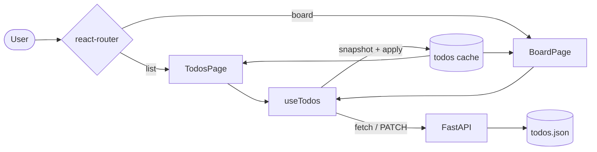
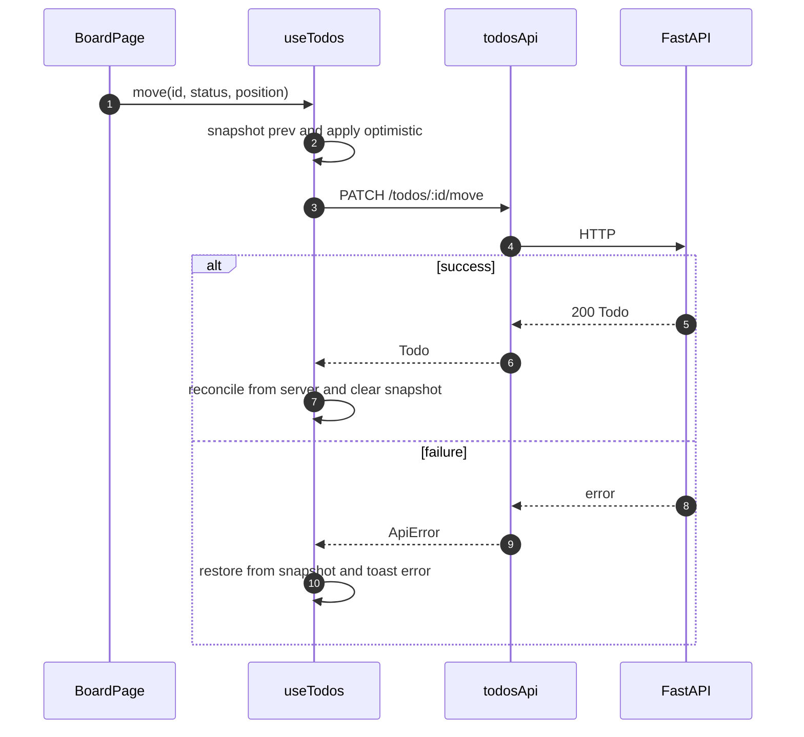
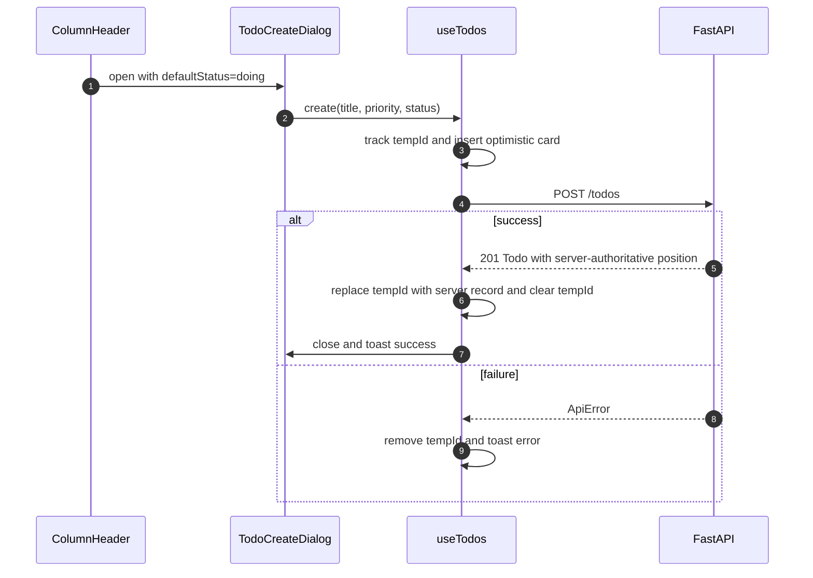

# Plan — Add Kanban view to the todos app

## 1. Summary

Add a `/board` route rendering three fixed columns (Todo / Doing / Done) backed by a replaced server-side `status` enum plus integer `position` ordering. Drag-and-drop uses `@dnd-kit` with keyboard sensor and custom announcements; optimistic UI lives in a hand-rolled reducer inside `useTodos` so a drag never snaps back. The list view keeps its existing shape at `/`. Headline tradeoff: we take on ~18 KB gz (`@dnd-kit` + router) and introduce a client-owned optimistic cache — the only way to meet the "no snap-back on drag" requirement without adopting SWR/TanStack Query.

## 2. Key design decisions

### 2.1 Accessibility target — WCAG 2.1 A (keyboard-reachable), not 2.2 AA

Keyboard operability only. `@dnd-kit`'s `KeyboardSensor` is the non-drag path; we override the default `announcements` prop to use `todo.title` and "position N of M" phrasing (defaults leak raw UUIDs — see `meta/research/add-kanban-view/accessibility.md`). No per-card status `<Select>` as a primary affordance — the user explicitly descoped AA. *Rejected:* WCAG 2.2 AA with per-card status Select; would have matched Linear/GitHub but doubles affordance surface for a single-user app.

### 2.2 Data model — replace `completed: bool` with `status: "todo"|"doing"|"done"`

Breaking change (Option A in `meta/research/add-kanban-view/data-model.md`). `TodoResponse` / `TodoCreate` / `TodoUpdate` all switch. Rationale: one source of truth, extensible (`"blocked"` later), and the checkbox affordance goes away cleanly. *Rejected:* Option B (keep `completed` as derived) — two fields to keep in sync, invites drift via `TodoUpdate`'s `exclude_unset`.

### 2.3 Migration — hard reset of `api/todos.json`

The file is reset to `[]` as a step in Phase 1. No Pydantic default for `completed`, no read-time backfill, no compat shim. Anti-pattern to avoid: `Optional`-everything on `TodoResponse` just to survive legacy rows (see `docs/blueprints/api/anti-patterns/schemas.md`). Rationale: single-user toy app, file is gitignored, user approved breakage.

### 2.4 Ordering — integer `position`, step 1000, append-bottom on cross-column move

`position: int` on every todo. New item is `max(position in destination column) + 1000`, `1000` if the column is empty. Reorder inside a column uses the integer midpoint `(prev + next) // 2`. Rebalance trigger: if `next - prev <= 1` at insert time, the client renumbers the destination column locally to `1000, 2000, …` and issues one `PATCH /todos/{id}/move` per affected card, sequentially (N server writes — acceptable because rebalance is rare, columns are small, and the single-flight refetch gate in `useTodos` suppresses racing reads). *Rejected:* server-side bulk-renumber endpoint (more API surface for a rare path), LexoRank (overkill for ~dozen cards), float positions (precision decay), linked-list (O(n) reads).

### 2.5 View coexistence — separate routes via `react-router` v7

Routes: `/` (list, current view), `/board` (Kanban). Router choice: **`react-router` v7** (data-router mode, ~11 KB gz, React 19 supported, de-facto standard, ships `<Link>` / `useNavigate` / `<Outlet>`). *Rejected:* TanStack Router (great type-safety but ~30 KB gz + a loader concept we don't need), `wouter` (~2 KB gz but the user wants future extensibility — nav chrome, eventual detail routes — and `react-router`'s layout-route pattern solves that natively). Introduces the codebase's first router and first nav chrome.

### 2.6 UI hosting — inside `web/src/features/todos/`

Follows `docs/blueprints/web/best-practices/folder-structure.md`: feature-scoped. New pages `todos-page.tsx` (already exists at `/`) and `board-page.tsx` (new, at `/board`) both sit in `features/todos/components/`. A tiny `app-layout.tsx` in `web/src/components/` owns the nav chrome (the two tabs) and is mounted as a react-router layout route rendering `<Outlet/>`. Dependency direction holds: `components/` never imports `features/`; `app-layout` knows only that it renders `<Outlet />`.

### 2.7 Optimistic UI — hand-rolled reducer inside `useTodos`

Reject SWR. Rationale (KISS, `docs/blueprints/web/clean-code/kiss.md`): we have exactly one query (`list`) and four mutations (create / update / move / remove), single-user no-accounts. SWR's cache-key / revalidation machinery is overkill. The reducer is colocated with the existing hook — no new deps, no new concepts. *Accepted cost:* we hand-roll cancel-in-flight-refetch, snapshot, and rollback. Concurrent-drag coordination is scoped away by decision 2.8. Implementation shape: `useTodos` owns `todos: Todo[]` plus two separate refs — `snapshotsRef: Map<id, Todo>` (pre-mutation state for update/move/remove rollback) and `tempIdsRef: Set<id>` (temp ids the create path must remove on rollback). Every mutator snapshots the relevant state, applies locally, fires the request, and clears or restores on settle. The single-flight refetch gate (ref-counted `inFlightRef`) suppresses refetch echoes while any mutation is outstanding.

### 2.8 Concurrency — document status quo (last-writer-wins)

Single user, single device. No `version: int`, no 409, no BroadcastChannel. Sync `def` handlers stay — the lost-update surface described in `meta/research/add-kanban-view/concurrent-edits.md` remains. Add a one-line docstring to each mutating route (`POST /todos/`, `PATCH /todos/{id}`, `PATCH /todos/{id}/move`, `DELETE /todos/{id}`) stating the last-writer-wins posture; correctness work is deferred per §7 → *Correctness & infrastructure*.

### 2.9 Storage atomicity — fix `JsonFileStorage.save`

`api/core/storage.py` lines 21–23 currently do `open("w")` + `json.dump` (truncates, then writes — a crash mid-write corrupts the file). Replace with write-to-tempfile + `os.replace`. Independent of every other decision; we fix it now.

### 2.10 Cross-column move policy — append-bottom of destination

Matches every surveyed tool's default (see `meta/research/add-kanban-view/column-ordering.md`). Keyboard-move uses arrow keys to fine-tune after the drop.

### 2.11 DnD library — `@dnd-kit`

`@dnd-kit/core` (~6 KB gz) + `@dnd-kit/sortable` (~4 KB gz). One `<DndContext>` wrapping all three columns; one `<SortableContext>` per column with `verticalListSortingStrategy`. Collision detection: `closestCorners` (better than `closestCenter` for cross-column cases per dnd-kit docs). Standard dnd-kit `<DragOverlay>` pattern for the floating card. `KeyboardSensor` uses `sortableKeyboardCoordinates` so arrows snap between sortable positions instead of moving by pixels.

### 2.12 Create form on Kanban view — shared dialog

The existing `<TodoCreateForm>` is split into wrapper-agnostic `<TodoCreateFormFields>` (fields + submit) and `<TodoCreateForm>` (list-view `<Card>` wrapper that composes the fields). On `/board` the fields are hosted inside a `<TodoCreateDialog>` that wraps `<dialog>` + `showModal()` exactly like `confirm-delete-dialog.tsx`. Triggers: (a) a page-header `+ New task` button opens the dialog with default status `"todo"`; (b) each column header has a `+` icon button that opens the same dialog prefilled with that column's status. The list view keeps its always-visible form at `/`. DRY: `<TodoCreateFormFields>` doesn't know whether it's inside a `<Card>` or a `<dialog>`; it accepts a `defaultStatus?: Status` prop.

### 2.13 Empty columns — accept emptiness (no backfill, no placeholder copy)

Industry default (see `meta/research/add-kanban-view/empty-states.md`). Empty `Doing` on day one is fine. Column body renders header + count + `+` button + empty space. No `<EmptyState>` inside a column.

### 2.14 Mobile — descoped

Desktop-first, no responsive breakpoints for the board. At narrow widths the default `grid-cols-3` compresses the three columns to fit the viewport (narrow columns with wrapped titles); we do not add `overflow-x-auto`, stack, swipe-snap, or minimum-column-width behaviour. Users on phones will see a cramped board — acceptable under the "desktop-first" posture. A proper mobile pass is listed in Follow-ups.

### 2.15 Focus after move — stay on card (dnd-kit default)

Default keyboard focus behaviour is correct; we don't override.

## 3. In-scope / Out-of-scope

**In scope**

- Replace `completed: bool` with `status: "todo"|"doing"|"done"` across API schemas, service, storage-consumer, types, and client types.
- Reset `api/todos.json` to `[]`.
- Add `position: int` to todos; server-side sort by `(status, position)` on board reads.
- New server route: `PATCH /api/todos/{id}/move` accepting `{status, position}` atomically.
- Atomic `JsonFileStorage.save` (tempfile + `os.replace`).
- Introduce `react-router` v7 with routes `/` and `/board` plus a thin layout with tab nav.
- Kanban page: three columns, drag-and-drop via `@dnd-kit`, keyboard sensor with custom announcements.
- Hand-rolled optimistic reducer in `useTodos` with snapshot/rollback for create / update / move / delete.
- Shared create dialog reachable from the page header and each column header.
- Toasts reused for success/failure feedback per `docs/design/rules.md` State Requirements.

**Out of scope (deferred — see Follow-ups)**

- Undo/redo for moves.
- Bulk selection / multi-card move.
- Card detail modal (inline title edit remains).
- WIP limits, filters, assignees, due dates.
- WCAG 2.2 AA (non-drag primary per-card Select).
- Mobile layouts (responsive breakpoints, swipe-snap, `TouchSensor` tuning, haptics).
- Concurrent-edit correctness (`version`/ETag, 409, BroadcastChannel, multi-tab sync).
- Empty-column heuristics (day-one Doing backfill, soft-hint copy).
- Card-hover reveal actions, drag handles on cards.
- Column customisation (add, rename, hide, reorder).

## 4. Architecture

### 4.1 Data-flow (route split + optimistic UI)



### 4.2 Sequence — drag Todo → Doing



### 4.3 Sequence — create from column `+`



Note: the server computes `position` on create (append-bottom of destination column), so the reconcile step may change the card's `position` from the optimistic value. Any in-flight `move` for the same card is gated by `inFlightRef`, so no reorder races this reconcile.

### 4.4 Kanban page component tree

```
BoardPage                         [container — uses useTodos]
└── BoardLayout                   [display — 3-column grid wrapper]
    ├── Column (todo)             [container — filters + sorts by position]
    │   ├── ColumnHeader          [display — title, count, +]
    │   ├── SortableContext
    │   │   └── SortableCard[]    [container — wraps useSortable]
    │   │       └── BoardCard     [display — title, priority badge, delete]
    │   └── ColumnEmptyBody       [display — spacer, acts as drop target when empty]
    ├── Column (doing)            [same]
    ├── Column (done)             [same]
    └── DragOverlay
        └── BoardCard             [display — floating copy]
TodoCreateDialog                  [container — hosts shared TodoCreateFormFields]
```

Display vs container follows `docs/blueprints/web/best-practices/component-structure.md`: `BoardCard` is pure (props in, JSX out); `SortableCard` wraps it with `useSortable`; `Column` owns the filter-and-sort + DnD droppable IDs; `BoardPage` owns data.

### 4.5 API surface

All responses use the existing error envelope from `api/core/exceptions.py` — no new error shape. New and changed routes (all under `/api`):

| Method | Path | Request | Response | Status codes |
|---|---|---|---|---|
| GET | `/todos/` | — | `TodoResponse[]` sorted by `(status order, position asc)` — status order is `todo < doing < done` | 200 |
| POST | `/todos/` | `TodoCreate {title, priority?, status?}` | `TodoResponse` | 201, 422 |
| PATCH | `/todos/{id}` | `TodoUpdate {title?, priority?, status?}` | `TodoResponse` | 200, 404, 422 |
| PATCH | `/todos/{id}/move` (new) | `TodoMove {status, position}` | `TodoResponse` | 200, 404, 422 |
| DELETE | `/todos/{id}` | — | — | 204, 404 |

`TodoUpdate` loses its `completed` field and gains optional `status`. `TodoMove` is a dedicated schema (both required) so a single atomic write carries the cross-column case (see `meta/research/add-kanban-view/optimistic-ui.md`).

### 4.6 Data model

Server `TodoResponse` (`api/todos/schemas.py`):

```
id: str
title: str (stripped, 1–200)
priority: "low"|"medium"|"high"    (default "medium")
status: "todo"|"doing"|"done"       (default "todo") — replaces completed
position: int                        (step 1000 within column)
created_at: datetime
updated_at: datetime
```

Client `Todo` (`web/src/features/todos/types.ts`) mirrors exactly. New constant `STATUS_COLUMNS: readonly { value: Status; label: string }[]` — an ordered array of Todo / Doing / Done, so the board always renders columns left-to-right in that order.

`position` semantics: only meaningful relative to siblings in the same `status`. Step 1000. Integer midpoint `(prev + next) // 2` on drop. Column-level renumber at insert time if `next - prev <= 1`. Append-bottom on create or cross-column move: `position = max(position in destination column, default=0) + 1000` (so an empty column's first card is `1000`).

Migration: `api/todos.json` replaced with `[]` in the same commit as the schema change.

## 5. Implementation phases

### Phase 1 — API data model + storage atomicity

*Intent:* Lay the server-side foundation for everything that follows — replace `completed` with `status`, introduce `position`, switch the list sort to `(status, position)`, make `JsonFileStorage.save` atomic, and reset `api/todos.json`. Nothing downstream (web types, DnD, optimistic reducer) can land until this schema is stable. Ends with the API still serving the existing list view unchanged from a functional standpoint, just backed by the new shape.

1. `api/core/storage.py` (lines 21–23) — replace `save()` body with tempfile + `os.replace`. Write to `self._path.with_name(f"{self._path.name}.tmp")`, flush + `fsync` the tempfile, then `os.replace(tmp, self._path)`. Keep the `Storage` Protocol (lines 6–8) unchanged (LSP: same signatures, same semantics, just atomic). Clean-code: SRP intact (storage writes).
2. `api/todos/schemas.py` — declare `Status = Literal["todo","doing","done"]` beside the existing `Priority` at line 7. Delete `completed` from `TodoUpdate` (line 30) and from `TodoResponse` (line 47). Add `status: Status` to `TodoCreate` (default `"todo"`), to `TodoUpdate` (optional), and to `TodoResponse`. Add `position: int` to `TodoResponse`. Add a new `TodoMove(AppBaseModel)` with `status: Status` and `position: int` (both required).
3. `api/todos/service.py` `create()` (lines 27–40) — initialise `status="todo"` (or the value from `data.status` once step 8 lands), compute `position = _next_position(items, status)`. Add module-level helper `_next_position(items, status) -> int`: `max((t["position"] for t in items if t["status"] == status), default=0) + 1000`. Remove the `"completed": False` line.
4. `api/todos/service.py` `list()` (lines 20–25) — change sort key to `(STATUS_ORDER[t["status"]], t["position"])` with module-level `STATUS_ORDER = {"todo": 0, "doing": 1, "done": 2}`. Drop the `PRIORITY_RANK`-based sort; priority becomes informational.
5. `api/todos/service.py` `update()` (lines 42–51) — unchanged structurally; `data.model_dump(exclude_unset=True)` now routes `status` through naturally. No position handling here.
6. `api/todos.json` — overwrite with `[]`.
7. `api/todos/router.py` (lines 10–28) — no handler changes yet; existing return-type annotations drive the response model.

Verify: `mise api:check` passes.

### Phase 2 — API move endpoint

*Intent:* Give the board the single atomic server operation it needs — `PATCH /todos/{id}/move` that writes both `status` and `position` in one request, avoiding the two-request cross-column failure mode. Also open up `POST /todos/` to accept `status` so the column-`+` create path doesn't need a follow-up PATCH. The API is feature-complete at the end of this phase.

8. `api/todos/service.py` — add `move(todo_id: str, data: TodoMove) -> dict`: locate todo, set `status=data.status` and `position=data.position`, bump `updated_at`, save. Raise `TodoNotFound` if missing. Also allow `create` to honour a client-supplied `status` (now on `TodoCreate`) so the board's column-`+` works without a follow-up PATCH. No midpoint logic in the server — the client supplies the new `position`; simpler and matches the single-user premise.
9. `api/todos/router.py` — add `@router.patch("/{todo_id}/move")` calling `service.move(...)`, returning `TodoResponse`. Keep routes thin per `docs/blueprints/api/best-practices/project-structure.md`.

### Phase 3 — Web data layer (optimistic reducer)

*Intent:* Turn `useTodos` from a refetch-on-mutate hook into an optimistic cache so drags don't snap back. This is the largest architectural change on the web side and carries all the correctness risk for the feature — snapshot/rollback, in-flight gating, temp ids for create. Done before any UI that depends on it, so bugs surface against the list view (which exercises create/update/remove) before DnD amplifies them.

10. `web/src/features/todos/types.ts` — mirror the server changes: delete `completed` from `Todo` and `TodoUpdate`, add `status: Status`, add `position: number`. Declare `Status = "todo"|"doing"|"done"` and `STATUS_COLUMNS: readonly { value: Status; label: string }[]` (ordered array, so the board always renders left-to-right in Todo / Doing / Done order).
11. `web/src/features/todos/api.ts` — add `move: (id, body: TodoMove) => api.patch<Todo>(`/api/todos/${id}/move`, body)`. Import `TodoMove` type.
12. `web/src/features/todos/hooks/use-todos.ts` — rewrite to a hand-rolled optimistic reducer (SRP: this hook owns the server-state seam). Shape:
    - `todos: Todo[]`, `status`, `error` unchanged.
    - Two separate refs with non-overlapping semantics:
        - `snapshotsRef = useRef<Map<string, Todo>>(new Map())` — pre-mutation todo captured on update / move / remove, used to restore on error.
        - `tempIdsRef = useRef<Set<string>>(new Set())` — optimistic-create placeholder ids that must be removed on error.
    - `inFlightRef = useRef(0)` bumped on mutation entry and decremented in `finally`; `refetch()` no-ops while `> 0` (suppresses the "refetch discards in-flight mutation" race described in `meta/research/add-kanban-view/optimistic-ui.md`).
    - `create(body)`: generate a `temp-${uuid}` id; add to `tempIdsRef`; append an optimistic card to state with `position` computed by the same append-bottom rule the server uses (`max(existing positions in body.status, default=0) + 1000` — implemented inline or reusing `computeDropPosition`'s append branch); POST; on success replace the temp card with the server record (the server is authoritative for `position`, so the value may differ from the optimistic guess); on error remove the temp card + toast.
    - `update(id, patch)`: store the pre-mutation todo in `snapshotsRef`; apply `{...todo, ...patch}`; PATCH `/todos/{id}` with the partial patch; on success reconcile from the server-returned todo + clear the snapshot; on error restore from snapshot + toast.
    - `move(id, status, position)`: same flow as `update`, but the PATCH body requires both `{status, position}` (not a partial) and hits `/todos/{id}/move`; success reconciles from the server-returned todo.
    - `remove(id)`: snapshot the todo; optimistic `filter(t => t.id !== id)`; DELETE; on success (204) just clear the snapshot — no body to reconcile; on error restore from snapshot + toast.
    - New helper `computeDropPosition(todos, destStatus, overId) -> { position, needsRenumber }` at `web/src/features/todos/position.ts` (pure). Integer midpoint `(prev + next) // 2`. When `next - prev <= 1`, sets `needsRenumber: true`; the caller then renumbers the destination column locally to `1000, 2000, …` and emits one `move` PATCH per affected card, awaited sequentially. The in-flight gate prevents refetch from racing the batch.
    Clean-code: colocating cache + mutations in one hook is KISS (see `docs/blueprints/web/clean-code/kiss.md`) — a library cache would fragment the data seam for marginal benefit on a four-mutation domain.
13. `useTodos`'s return signature gains `move`; existing callers keep their shape.

### Phase 4 — Router introduction + list view at `/`

*Intent:* Introduce the codebase's first router and nav chrome, migrating the existing list view to `/` so we have a surface to hang `/board` off of in Phase 5. Also resolve the fallout from deleting `completed`: the list view's checkbox is replaced (pending the open decision in step 19) and stats update to count `status === 'done'`. At the end of this phase both the list view and nav tabs work; `/board` is a stub that needs Phase 5.

14. Install `react-router@7` in `web/`.
15. `web/src/main.tsx` — wrap `<App/>` with `<BrowserRouter>` from `react-router`.
16. `web/src/App.tsx` — replace body with `<ToastProvider>` wrapping a route tree that mounts `AppLayout` as a layout route:

    ```tsx
    <Routes>
      <Route element={<AppLayout />}>
        <Route index element={<TodosPage />} />
        <Route path="board" element={<BoardPage />} />
      </Route>
    </Routes>
    ```
17. `web/src/components/app-layout.tsx` (new) — thin display: site header with `h1 "Todos"` and a `<nav>` containing two `<NavLink>` tabs ("List", "Board") styled with `cva` variants (no arbitrary values; tokens only), followed by `<Outlet/>`. Uses design tokens per `docs/design/typography.md` and `colours.md`. Not under `features/` because it knows nothing about todos.
18. `web/src/features/todos/components/todos-page.tsx` — unchanged structurally. Adjust `todo-list.tsx` and `todo-item.tsx` for the removed `completed` field in the next steps.
19. **Open decision — list-view affordance for status change.** With `completed` removed, the current checkbox toggle must be replaced. Options:
    - **(a) Per-row status `<Select>`** — reuses `web/src/components/select.tsx` (same pattern as the priority select already in `todo-item.tsx`). Keyboard-friendly, direct. Recommended.
    - **(b) Status badge (display only) + change-via-edit** — visually simpler, hides the affordance behind the existing edit flow.
    - **(c) Cycle button** — one click advances todo → doing → done. Surprising semantics, not recommended.
    Steps below assume (a); confirm before Phase 4 starts if a different path is wanted.
20. `web/src/features/todos/components/todo-list.tsx` — replace `handleToggle` with `handleStatusChange(todo, status)` that calls `onUpdate(todo.id, { status })`. Strikethrough styling becomes `todo.status === 'done'`. Stats-line "completed" count becomes `todos.filter(t => t.status === 'done').length`.
21. `web/src/features/todos/components/todo-item.tsx` — delete the `<Checkbox>` block. In its place, left-align a status `<Select>` reusing `web/src/components/select.tsx` (same pattern as the existing priority select in this file).

### Phase 5 — Kanban page shell at `/board` (no DnD yet)

*Intent:* Build the Kanban page as a read-only display — three columns, sorted cards, headers with count + `+`, board card visuals — with zero drag behaviour. Lets us validate layout, typography, spacing, and the display/container split in isolation. Everything here is a pure React composition against the state `useTodos` already provides from Phase 3.

22. `web/src/features/todos/components/board-page.tsx` (new) — container: `const { todos, status, error, move, create, remove, update, refetch } = useTodos()`. Renders header "Board" + `+ New task` primary button → opens `TodoCreateDialog` (Phase 7). Renders `<BoardLayout>` containing three `<Column>` children. Loading and error states per Phase 8.
23. `web/src/features/todos/components/board-layout.tsx` (new) — pure display. `div` with `grid grid-cols-3 gap-16`. Accepts `children` slot (composition). No `max-w` cap (overrides the 720px in `todos-page.tsx`); columns share the available width evenly (each gets ~33% of the container, compressing together at narrow viewports — see decision 2.14).
24. `web/src/features/todos/components/column.tsx` (new) — container: `useMemo(() => todos.filter(t => t.status === status).sort((a,b) => a.position - b.position), [todos, status])`. Renders `<ColumnHeader>` + sorted card list. Props: `{ status: Status, label: string, cards: Todo[], onAdd, onMove, onUpdate, onRemove }`.
25. `web/src/features/todos/components/column-header.tsx` (new) — pure display. Shows the column `label` (typography per `docs/design/typography.md`), `count`, and a `+` icon button whose `aria-label` is "Add task to " followed by the column label (e.g. "Add task to Doing"). Icon is an inline SVG (project convention — no icon library in dependencies; see the trash SVG in `todo-item.tsx`) using a `plus` path at the icon size specified in `docs/design/iconography.md`.
26. `web/src/features/todos/components/board-card.tsx` (new) — pure display: title (truncate), priority badge (reuses the `PRIORITY_BADGE` map at `todo-item.tsx:17` — lift to `web/src/features/todos/priority.ts` to DRY across list and board), delete button (ghost intent) using the same inline trash SVG already in `todo-item.tsx`. Card uses `bg-bg-elevated rounded-md p-12 flex flex-col gap-8` per `docs/design/radius-and-elevation.md` and `spacing-and-layout.md`. No arbitrary values.

At the end of Phase 5 the route renders and shows sorted cards per column; DnD still disabled.

### Phase 6 — DnD wiring

*Intent:* Make the board interactive. Add `@dnd-kit` sensors, a droppable-per-column, a sortable-per-card, and route drop events into the optimistic `move` mutation from Phase 3 via a pure logic module (`board-dnd.ts`) that keeps collision detection and position math out of the React tree for unit-testability. Keyboard sensor + custom announcements satisfy the WCAG 2.1 A target.

27. Install `@dnd-kit/core` and `@dnd-kit/sortable` in `web/`.
28. `web/src/features/todos/components/board-page.tsx` — wrap `<BoardLayout>` in `<DndContext sensors={[PointerSensor, KeyboardSensor]} collisionDetection={closestCorners} onDragStart={…} onDragEnd={…} announcements={kanbanAnnouncements}>`. Keep a local `activeCard` state for the `<DragOverlay>`.
29. `web/src/features/todos/components/column.tsx` — wrap cards in `<SortableContext items={cardIds} strategy={verticalListSortingStrategy}>`. Also register the column body as a droppable via `useDroppable({ id: `column:${status}` })` so empty columns still accept drops.
30. `web/src/features/todos/components/sortable-card.tsx` (new) — thin container: wraps `<BoardCard>` with `useSortable({ id: todo.id })`, applies `transform` / `transition` inline styles (legitimate per `docs/blueprints/web/best-practices/styling.md` — inline styles allowed for values that genuinely change at runtime).
31. `web/src/features/todos/board-dnd.ts` (new) — pure-function module extracted for unit-testability (keeps collision-detection wiring out of the React component): `handleDragEnd(event, todos) -> { id, status, position } | null`. Computes destination column from `over.id` (column droppable id or sibling card id) and **delegates position math to `computeDropPosition`** from `web/src/features/todos/position.ts` — do not reimplement the midpoint/append rules here. Exports `kanbanAnnouncements: Announcements` whose messages reference `todo.title` (never UUIDs) and "position N of M" phrasing for `onDragStart` / `onDragOver` / `onDragEnd` / `onDragCancel`.
32. Focus behaviour: default dnd-kit keyboard focus is correct ("stay on card"). No overrides.

### Phase 7 — Create dialog on board

*Intent:* Replace the "always-visible form" pattern on `/board` with a dialog, triggered either from a page-header button or from each column's `+`. Split `TodoCreateForm` into a wrapper-agnostic fields component (reused in both the dialog and the list-view card wrapper) so the list view remains untouched and both paths share validation. Nothing outside the feature folder changes.

33. `web/src/features/todos/components/todo-create-form.tsx` — split into two files for reuse:
    - `todo-create-form-fields.tsx` (new) — pure fields + submit handler via callback prop; accepts `defaultStatus?: Status` (default `"todo"`); submit payload is `{title, priority, status}`.
    - `todo-create-form.tsx` — wraps the fields in the existing `<Card>` for list view. Unchanged public API.
    DRY per `docs/blueprints/web/clean-code/dry.md`; OCP — the fields component is open for extension (different wrappers) without modification.
34. `web/src/features/todos/components/todo-create-dialog.tsx` (new) — follows the existing `confirm-delete-dialog.tsx` pattern: `<dialog>` ref + `showModal()` effect + Escape handler. Renders an `<h2 id="todo-create-dialog-title">` whose text is "New task" when `defaultStatus === "todo"` and `"Add task to ${STATUS_COLUMNS.find(...).label}"` otherwise (e.g. "Add task to Doing"). `<dialog aria-labelledby="todo-create-dialog-title">`. Body is `<TodoCreateFormFields defaultStatus={…} onCreate={…} onCreated={close} />`.
35. `web/src/features/todos/components/board-page.tsx` — wire the page-header `+ New task` button and each `<ColumnHeader>`'s `+` to the same dialog. Local state `createFor: Status | null` controls open + default.
36. `web/src/features/todos/components/todos-page.tsx` — unchanged (list view keeps its always-visible form).

### Phase 8 — Polish

*Intent:* Finish the State Requirements checklist from `docs/design/rules.md` — loading, error, success toast feedback — and close small accessibility / visual details (focus-visible on cards, nav active styling, dead-import cleanup). Purely additive; no structural change. The manual smoke pass in §6 runs against the output of this phase.

37. Loading state (per `docs/design/rules.md` State Requirements) on `/board`: three column shells with skeleton cards (reuse `web/src/components/skeleton.tsx`) during `status === 'loading'`.
38. Error state on `/board`: `<ErrorState message=… onRetry={refetch}/>` above the board (not per-column).
39. Toasts: reuse `useToast` for all success/failure events. Move success → `"Moved {title} to {column}"`. Delete → existing "Task deleted".
40. Focus-visible on cards: `focus-visible:outline-2 focus-visible:outline-border-accent` (matches the existing focus style in `todo-item.tsx`).
41. List view keeps its existing `max-w-[720px]` cap on `todos-page.tsx` (pre-existing arbitrary-value violation of `docs/blueprints/web/best-practices/styling.md`; token refactor tracked in Follow-ups — out of scope for this ticket). `board-page.tsx` uses no cap, just `px-32` matching `docs/design/spacing-and-layout.md` ("32px page content padding"). Board fills available width.
42. Nav tabs focus + active styling: `<NavLink>`'s `isActive` drives `text-accent-primary` on the active tab, `text-text-secondary` otherwise.
43. Remove now-unused imports (`Checkbox` from list view, any `completed` references in fixtures).
44. Smoke-test paths manually (see §6 Testing strategy).

## 6. Testing strategy

No automated-test harness exists in the stage today (no `tests/` directory under `api/`, no RTL/Vitest config under `web/`). Introducing one is a larger investment than this ticket warrants; automated coverage — axe-core for a11y, Playwright for DnD, Vitest+RTL for `useTodos` rollback — is listed under Follow-ups → Test + infra.

For the initial ship we rely on a manual smoke pass covering the critical paths:

- `/` renders the existing list; status changes persist across reload.
- `/board` renders three columns with cards placed correctly by status and position.
- Drag Todo → Doing: card stays in Doing after release; toast fires; reload confirms persistence.
- Drag a card up/down within a single column: the order updates correctly and persists across reload. Repeat drags on the same neighbours until the rebalance branch fires (`next - prev <= 1`); verify the destination column's `position` values renumber to `1000, 2000, …` in `api/todos.json`.
- Keyboard drag: Tab to a card, Space to pick up, arrow to move, Space to drop. Announcements use the todo title, not a UUID.
- Create from column `+`: dialog opens prefilled with the correct default status; card appears at the column bottom; reload persists.
- Delete from column: card disappears; toast fires; reload persists.
- Forcing an API error (e.g. kill the api process mid-drag): card snaps back to origin; error toast fires; subsequent mutations work after restart.

## 7. Follow-ups

### Correctness & infrastructure

- `version: int` field + 409 retry for concurrent-edit correctness; consider BroadcastChannel for multi-tab sync.
- Rate-limiting renumber passes — if the codebase grows beyond toy sizes, move midpoint + renumber logic server-side and switch to LexoRank.
- `orjson` response class + pagination when the list grows (see `docs/blueprints/api/anti-patterns/performance.md`).
- Replace the pre-existing `max-w-[720px]` arbitrary value in `todos-page.tsx` with a token-backed max-width.

### UX

- Undo/redo for moves (client-side stack; integrates with the existing optimistic reducer).
- Bulk select + multi-card move (shift-click range, drag group).
- Card detail modal (replaces or augments inline title edit).
- Card hover-reveal actions, drag handles.
- Empty-Doing day-one heuristic (highest-priority → Doing) if emptiness-as-default proves confusing.

### Scope expansion

- WCAG 2.2 AA: per-card status `<Select>` as a primary non-drag affordance on the board; drag becomes mouse-only overlay.
- Mobile layout: desktop-first becomes desktop+stack or swipe-snap; `@dnd-kit` `TouchSensor` tuning; haptics (Android only).
- Filters (priority, text search) scoped via query params since routes already exist.
- WIP limits per column (Jira/GitHub-style count badges).
- Column customisation (add, rename, hide, reorder).
- Assignees / collaborators (blocked by project non-goals; listed for completeness).

### Test + infra

- Automated a11y checks in CI (axe-core).
- Playwright DnD tests covering cross-column drag, within-column reorder, keyboard drag.
- Vitest + RTL test for `useTodos` optimistic apply + rollback on simulated API error.
